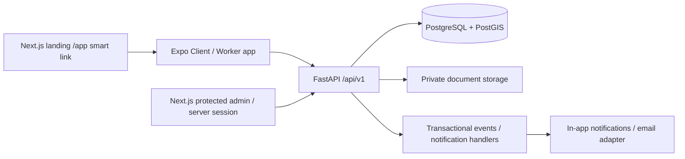

# Architecture
## Platform and ownership

Deploy a modular monolith. API and event delivery may be separate processes from the same codebase, never independent microservices tonight. Mobile/admin consume the same authoritative API. Next.js protects admin server routes; operations API separately validates session and permissions on every request.

Modules: auth, users, clients, organizations (reserved), workers, services, locations, availability, verification, jobs, matching, offers, assignments, shifts, attendance, replacements, incidents, reviews, pricing, payments, ledger, payouts, subscriptions (reserved), notifications, admin, audit. Each module separates transport schemas/router, service logic, persistence models/repository and typed domain errors, or an equivalent clean grouping. Dependencies enter via services. Routers validate transport and delegate; they never assign arbitrary statuses.

## Persistence and consistency
SQLAlchemy async-capable, Alembic revision history, UUID PKs, timezone-aware timestamps, integer money. Critical business writes use one transaction. Lock ordering: JobRequest, worker/profile when needed, Assignment, Shift, Offer. Serialize accept against job and worker to protect headcount and overlapping worker schedules; use exclusion constraints where applicable. Read candidate results are advisory; acceptance rechecks eligibility. Unique constraints and idempotency records are final safeguards. Do not rely on frontend disabled buttons.

JobRequest expresses demand; JobOffer negotiates; Assignment links worker to demand; Shift is an actual work instance. Recurring jobs produce multiple shifts, never a single mutable attendance field. Job snapshots preserve location and accepted commercial terms. An original assignment stays visible after replacement.

## Authentication and sessions
Argon2id hashes; normalized email and E.164 phone unique at DB level. Short-lived signed access JWT with explicit issuer/audience/expiry/subject/session ID; opaque random refresh token, SHA-256 hash in DB, rotating per use. Session family detects replay and revokes family. Compare tokens safely; expiry/revocation/account status checked server-side. Logout revokes session; password reset revokes all sessions. Do not log passwords, bearer tokens or reset links.
Mobile refresh tokens in SecureStore; access in memory or SecureStore. Serialize refresh requests. Next.js server-side session/BFF uses HttpOnly Secure SameSite cookies, Origin/CSRF protection and no tokens in browser storage. User roles loaded server-side; active mode conveys no authority. Rate-limit auth and reset; enumeration-safe reset response and bounded login attempts.
Reset adapter sends a short-lived single-use random token; DB stores hash only, consumes atomically. Email delivery unconfigured is a release dependency, not a returned raw token. Verification enforcement is configuration-driven. Email/SMS/WhatsApp providers never own user primary keys.

## Location and documents
Address stores structured fields and WGS84 geography point. Copy location into immutable JobRequest snapshot. Service areas belong to City and store radius or polygon boundaries. ST_DWithin geography uses meters. Geo check-in uses foreground position, bounded accuracy/freshness/time window; server time is authoritative. Manual attendance is an audited separate action after a request, never a fake geo pass.
Documents use private object keys and metadata. Owner/authorized reviewer gets short-lived access or authenticated streaming. Allowlisted media/type/size validation and safe filenames; access scope cannot be supplied by the uploader. No unnecessary Aadhaar data, public URLs or document bytes in relational records. Local private storage adapter may support development; durable private storage and backups are production gates.

## Events, errors and operations
Transactionally record domain events/outbox alongside state. Handlers create Notification records with route/entity payloads and uniqueness per recipient/event. Retry-safe handlers; external email/push delivered after commit with bounded retries. Audit important admin and override actions (actor, action, entity, redacted before/after/reason, request ID, UTC). Error contract is uniform including validation/auth/unexpected errors; sanitize internal errors.
Idempotency key scoped by actor+action with request hash, stored response and expiry. Same request replays result; different request using same key returns 409 IDEMPOTENCY_CONFLICT. Concurrency losers return domain conflicts. Minimize sensitive logs; structured request IDs, liveness/readiness, backups and restore rehearsal are deployment requirements.

## Account deletion
Authenticated in-app delete entry: explain retained financial/safety obligations, require reauthentication, record deletion request, revoke sessions and disable access. Resolve active jobs through operations, remove/anonymize non-required profile/document data under approved retention rules. Never cascade-delete historical jobs/ledger. Final retention durations/policy require owner review before production.
